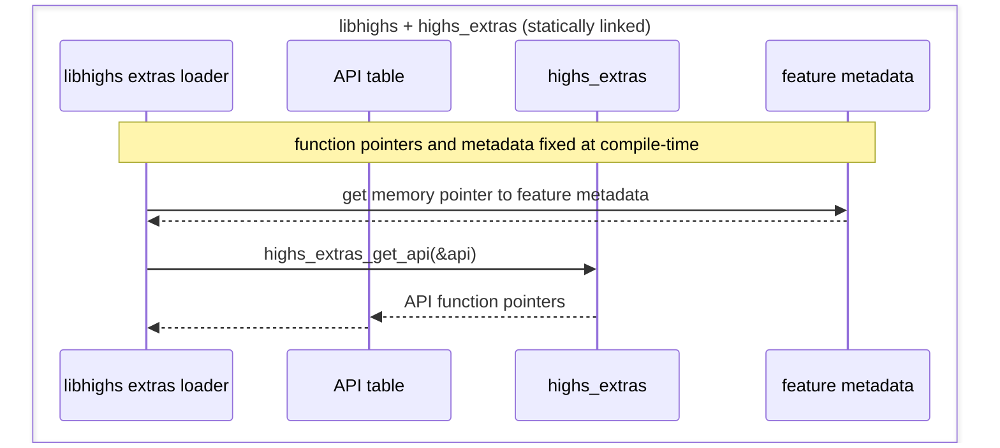
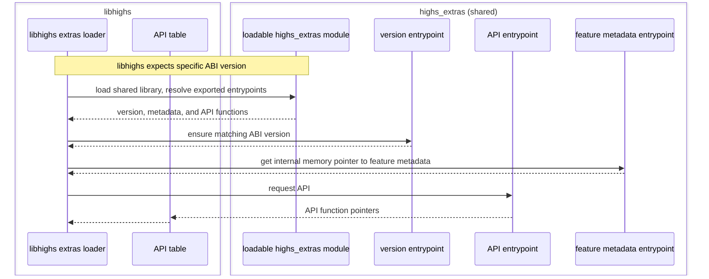
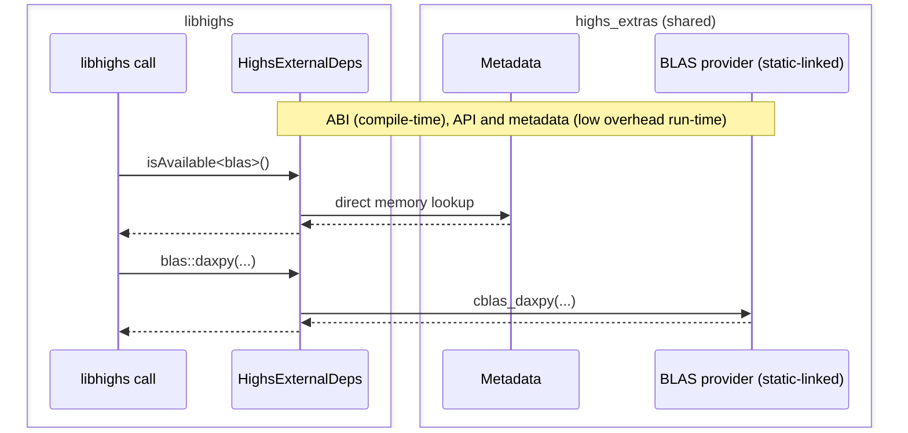

# External Dependencies

This directory contains the code for external dependencies. We consider three individual components, although they may be combined depending on build configuration (e.g., static linking).

- `app`: command-line executable
- `libhighs`: main library
- `highs_extras`: optional external dependencies (allows less permissive licensing)

## `app`

| name | enabled_if | provider | version | license | info |
| --- | --- | --- | --- | --- | --- |
| cli11 |  | CLI11 | 2.5.0 | BSD-3-Clause | Command-line parser |

## `libhighs`

| name | enabled_if | provider | version | license | info |
| --- | --- | --- | --- | --- | --- |
| pdqsort |  | pdqsort | git:b1ef26a | Zlib | Pattern-defeating quicksort |
| zstr | `ZLIB_FOUND` | zstr | 1.0.6 | MIT | Streaming support used with compressed model IO |
| zlib | `ZLIB_FOUND` | ZLIB | `ZLIB_VERSION` | Zlib | Compressed input support |
| cuda | `CUPDLP_GPU` | NVIDIA Driver API | runtime-detected | N/A (not redistributed) | NVIDIA GPU acceleration via PTX JIT compilation (runtime optional) |

## `highs_extras`

Wrapper-backed features exposed through `HighsExtrasApi` and `HighsExternalDeps`. May contain restrictive licensing.

| name | enabled_if | provider | version | license | info |
| --- | --- | --- | --- | --- | --- |
| amd | `HIPO` | SuiteSparse AMD | 7.12.1+highs | BSD-3-Clause | Approximate minimum degree ordering (adapted for HiGHS) |
| blas | `HIPO` | `HIGHS_BLAS_VENDOR` | `HIGHS_BLAS_VERSION` | `HIGHS_BLAS_LICENSE` | The configured BLAS provider |
| metis | `HIPO` | METIS-GKlib | 5.2.1+highs | Apache-2.0 | Graph partitioning and fill-reducing matrix ordering (adapted for HiGHS) |
| rcm | `HIPO` | SPARSEPAK | unversioned+highs | MIT | Reverse Cuthill McKee (RCM) ordering (adapted for HiGHS) |

 

# Adding a new Dependency

The following is a helpful guide to adding a new third party dependency.

1. Decide whether the dependency belongs to `app`, `libhighs`, or `highs_extras`.
2. Add or update the manifest row in the matching table above so the README stays aligned with the code.

### app

CLI dependencies that are not part of `libhighs`.

3. Update `app/CMakeLists.txt` if the dependency needs additional include paths, sources, compile definitions, link libraries, or post-build runtime handling.
4. Add the relevant `#include` and dependency usage (wrap with `#ifdef` when compile-time optional).
5. Add trait metadata in `app/HighsAppExternalDeps.h`

### libhighs

Main solver library dependencies that are compiled directly and not via `highs_extras`.

3. Add the dependency into `highs/CMakeLists.txt` and `CMakeLists.txt` as required.
4. Add relevant `#include` and dependency usage (wrap with `#ifdef` when compile-time optional).
5. Add the trait dependency metadata in `highs/HighsExternalDeps`

### highs_extras

Optional or more restrictively licensed functionality that should be separated from main solver library.

3. Add implementation source code (or package management) in `extern/CMakeLists.txt` and `cmake/sources.cmake`.
4. If the feature needs new configure-time discovery, cache variables, or provider selection, wire that through `CMakeLists.txt`.
5. Update `HighsExtrasExternalDeps.h`:
   - feature metadata
   - exported method list
   - wrapper methods
6. Update `HighsExtrasExternalDeps.cpp`:
   - feature information
7. Update `HighsExtrasApi.cpp`:
   - feature binding
8. Add relevant `HighsExtras::<feature>::<method>(...)` calls to libhighs, ensuring that `HighsExternalApi::isAvailable<feature>()` has been checked beforehand.

 

# Implementation Details

## Runtime Flow

We aim to have extremely low-overhead separation of external dependencies. The loading/dispatch flow is slightly different depending whether `highs_extras` is statically or dynamically linked.  There are more opportunities for compile-time optimizations when statically linked, however, the run-time overhead in shared mode is minimal.

Initialization is performed once per process and is thread-safe.

### Static-linking initialization

### Shared library initialization

### Shared-library call example

## Feature Traits and Wrapper Functions

### Traits
Each external dependency has an associated feature trait. These traits can be used for availability checks `isAvailable<...>()` or  detailed information `getThirdPartyNotice<...>`.

The traits can also be grouped at compile-time, e.g., `hipo = require<amd, blas, metis, rcm>`.

Examples:

- `HighsExternalApi::isAvailable<HighsExtras::blas>()`
- `HighsExternalApi::isAvailable<HighsExtras::blas, HighsExtras::zlib>()`
- `HighsExternalApi::getThirdPartyNotice<HighsExtras::hipo>()`

### Wrappers

Dependencies for `libhighs` are used directly or enabled via `#ifdef` flags, whereas dependencies for `highs_extras` are implemented as nullable function pointers.

To call an external method we use  `HighsExtras::<feature>::<method>()`.  These are lightweight static-inline wrapper functions to the function pointer APIs.

**Note: We assume that** `HighsExternalApi::isAvailable<feature>()` **has already been checked** when calling `<feature>::<method>(...)`.

Examples:

- `HighsExtras::blas::daxpy(...)`
- `HighsExtras::rcm::genrcm(...)`

## Build Modes

| Build mode | `highs_extras` output |
| --- | --- |
| `HIPO=OFF, BUILD_SHARED_EXTRAS_LIB=OFF` | linked statically without `hipo` features. Compile-time optimizations should remove inaccessible code. |
| `HIPO=OFF, BUILD_SHARED_EXTRAS_LIB=ON` | shared library with null pointers for `hipo` features. |
| `HIPO=ON , BUILD_SHARED_EXTRAS_LIB=OFF` | linked statically and includes `hipo` features. |
| `HIPO=ON , BUILD_SHARED_EXTRAS_LIB=ON` | shared library and includes `hipo` features. |

There is a subtle difference between compile-time available and run-time available features.  The main benefit appears when a feature is *unavailable* at compile-time, so that the compiler can perform additional optimizations.

However, for best compatibility, the default build assumes all features are available at compile-time, with run-time checks.
